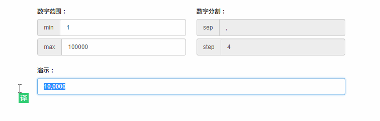

# ct-adc-custom-input

> 基于 Vue2.0 的输入框定制化

## 目录

- [Demo Build Setup](#demo-build-setup)
- [在线演示](#在线演示)
- [代码示例](#代码示例)
- [事件](#事件)
- [杂记](#杂记)


## Demo Build Setup

``` bash
# install dependencies
npm install

# serve with hot reload at localhost:8080
npm run dev

# build for production with minification
npm run build

# build for production and view the bundle analyzer report
npm run build --report
```

For detailed explanation on how things work, checkout the [guide](http://vuejs-templates.github.io/webpack/) and [docs for vue-loader](http://vuejs.github.io/vue-loader).

## 在线演示

- [number-input](http://htmlpreview.github.io/?https://github.com/ct-adc/ct-adc-custom-input/blob/master/view/number-input-demo.html) 
